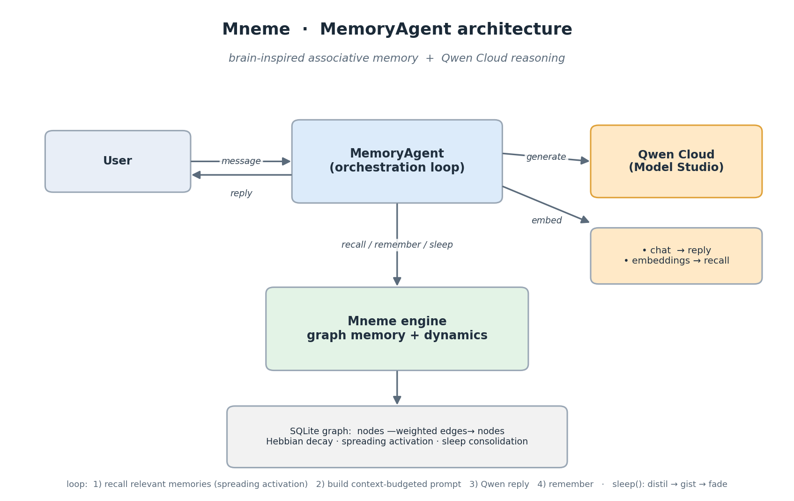

# Mneme — a brain-inspired memory for agents

> **Qwen Cloud Global AI Hackathon · Track 1: MemoryAgent**

Most "agent memory" today is a vector database: embed every message, retrieve
the most *similar* chunks. That retrieves, but it doesn't **remember** — it
never forgets gracefully, never consolidates, and floods a limited context
window with near-duplicate fragments.

**Mneme** models memory the way a brain does:

| Brain | Mneme |
|---|---|
| memories + associations | **graph**: nodes (memories) + weighted edges (relations) |
| "cells that fire together wire together" | **Hebbian reinforcement**: accessing a memory strengthens its edges |
| unused memories fade | **exponential decay** of unreinforced edges (computed lazily at recall) |
| recall is associative | **semantic seed** (Qwen embeddings) → **spreading activation** across the graph |
| sleep moves memories hippocampus → neocortex | **sleep consolidation**: raw episodic fragments are distilled into a durable *gist*, then fade |

The result is a memory that **accumulates experience, surfaces what matters,
forgets the trivial on its own, and stays small enough to fit a context
window** — exactly what the MemoryAgent track asks for.

## How it maps to the track

> *"Build an Agent with persistent memory that autonomously accumulates
> experience, remembers user preferences, and makes increasingly accurate
> decisions across multi-turn, cross-session interactions... efficient memory
> storage and retrieval, timely forgetting of outdated information, and
> recalling critical memories within limited context windows."*

- **Accumulates experience / cross-session** — every turn is stored; the graph persists in SQLite.
- **Remembers preferences** — `sleep()` distils raw turns into stable preference/profile gists.
- **Efficient retrieval** — spreading activation returns the *associatively* relevant set, not just text-similar chunks.
- **Timely forgetting** — Hebbian decay + `forget_stale()` sink unused, isolated memories; consolidated gists are protected.
- **Limited context window** — recall is top-k and gist-first, so the prompt carries the distilled essence, not raw history.

## Architecture



```
            ┌──────────────────────────────────────────────┐
   user ───►│  MemoryAgent (agent.py)                       │
            │    1. recall(query)  ──► spreading activation │
            │    2. build context-budgeted prompt           │
            │    3. Qwen generates grounded reply ──────────┼──► Qwen Cloud
            │    4. remember(turn)  ──► accumulate           │   (Model Studio,
            │                                                │    OpenAI-compatible)
            │    sleep(): distil fragments ─► gist ─► fade   │
            └───────────────┬────────────────────────────────┘
                            │
                  ┌─────────▼──────────┐
                  │ Mneme engine        │   graph memory (SQLite)
                  │ memory_core.py      │   nodes ─edges(strength,decay)─ nodes
                  └─────────────────────┘
```

## Qwen Cloud integration

Qwen on **Alibaba Cloud Model Studio** powers two parts of the system, both via
its OpenAI-compatible endpoint (standard `openai` SDK, `base_url` pointed at
Alibaba's gateway — see `mneme/qwen_client.py`):

- **Chat** (`qwen-plus` / `qwen-max`) — generates replies grounded in recalled memory.
- **Embeddings** (`text-embedding-v3`) — semantic seeding for recall, so "pet care"
  finds "the user's dog" even with zero word overlap. Spreading activation runs on top.

```bash
export DASHSCOPE_API_KEY="<your hackathon key>"
export QWEN_MODEL="qwen-plus"        # or qwen-max / qwen3-max
# International (Singapore) endpoint is the default:
# export QWEN_BASE_URL="https://dashscope-intl.aliyuncs.com/compatible-mode/v1"
```

## Quick start

```bash
pip install -r requirements.txt
python -m demo.demo          # cross-session memory demo (needs DASHSCOPE_API_KEY)
```

The Mneme **engine** (`mneme/memory_core.py`) runs on the Python stdlib alone —
you can explore graph memory, recall, and consolidation without any API key.

## Layout

```
mneme/
  memory_core.py   # the brain-inspired graph memory engine (no LLM needed)
  qwen_client.py   # OpenAI-compatible Qwen / Model Studio client
  agent.py         # MemoryAgent: recall → Qwen → remember → sleep
demo/
  demo.py          # scripted cross-session demo
```

## License

MIT — see [LICENSE](LICENSE).

## Related

**[AI Memory Toolkit](https://runiverse83.gumroad.com/l/ai-memory-toolkit)** — a standalone, single-file version of the Mneme memory engine packaged for drop-in use in any LLM agent project. Includes usage guide and ready-to-run examples.
